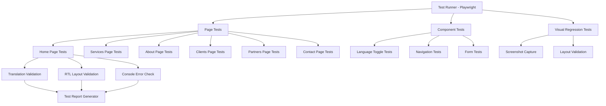

# Design Document: Arabic Translation and RTL Testing Suite

## Overview

This design implements a comprehensive automated testing suite for verifying Arabic language translation and RTL (right-to-left) layout functionality across the entire website. The solution uses Playwright for end-to-end testing, providing visual regression testing, DOM validation, and functional testing capabilities.

The testing suite will verify that:
1. All text content is correctly translated to Arabic
2. RTL layout is properly applied with correct directionality
3. Language toggle functionality works correctly
4. Language preferences persist across sessions
5. Forms and interactive elements work in Arabic RTL mode
6. Responsive behavior is correct across all viewport sizes
7. No console errors occur during language switching

## Architecture

### High-Level Architecture



### Test Organization Structure

```
tests/
├── e2e/
│   ├── arabic-translation/
│   │   ├── home.spec.ts
│   │   ├── services.spec.ts
│   │   ├── about.spec.ts
│   │   ├── clients.spec.ts
│   │   ├── partners.spec.ts
│   │   └── contact.spec.ts
│   ├── language-toggle/
│   │   ├── toggle-functionality.spec.ts
│   │   └── persistence.spec.ts
│   └── rtl-layout/
│       ├── layout-validation.spec.ts
│       └── responsive.spec.ts
├── helpers/
│   ├── arabic-test-utils.ts
│   ├── rtl-validators.ts
│   └── screenshot-utils.ts
└── fixtures/
    └── test-data.ts
```

## Components and Interfaces

### 1. Test Utilities Module

**File:** `tests/helpers/arabic-test-utils.ts`

```typescript
interface ArabicTestUtils {
  // Switch to Arabic language
  switchToArabic(page: Page): Promise<void>
  
  // Switch to English language
  switchToEnglish(page: Page): Promise<void>
  
  // Verify text is in Arabic (contains Arabic characters)
  isArabicText(text: string): boolean
  
  // Verify text is in English (contains only Latin characters)
  isEnglishText(text: string): boolean
  
  // Get all visible text on page
  getAllVisibleText(page: Page): Promise<string[]>
  
  // Verify no English text remains (except for proper nouns, emails, etc.)
  verifyNoEnglishText(page: Page, allowedExceptions?: string[]): Promise<boolean>
}
```

**Responsibilities:**
- Provide reusable functions for language switching
- Text validation utilities
- Common test operations

### 2. RTL Validation Module

**File:** `tests/helpers/rtl-validators.ts`

```typescript
interface RTLValidators {
  // Verify HTML dir attribute
  verifyDirAttribute(page: Page, expected: 'rtl' | 'ltr'): Promise<boolean>
  
  // Verify text alignment
  verifyTextAlignment(element: Locator, expected: 'right' | 'left'): Promise<boolean>
  
  // Verify flex direction
  verifyFlexDirection(element: Locator, expected: 'row-reverse' | 'row'): Promise<boolean>
  
  // Verify element positioning (right vs left)
  verifyElementPosition(element: Locator, side: 'right' | 'left'): Promise<boolean>
  
  // Verify navigation menu alignment
  verifyNavigationAlignment(page: Page): Promise<boolean>
  
  // Verify form input alignment
  verifyFormAlignment(page: Page): Promise<boolean>
}
```

**Responsibilities:**
- Validate RTL-specific CSS properties
- Check layout directionality
- Verify element positioning

### 3. Screenshot Utilities Module

**File:** `tests/helpers/screenshot-utils.ts`

```typescript
interface ScreenshotUtils {
  // Capture full page screenshot
  captureFullPage(page: Page, name: string, language: 'en' | 'ar'): Promise<string>
  
  // Capture element screenshot
  captureElement(element: Locator, name: string, language: 'en' | 'ar'): Promise<string>
  
  // Capture screenshots at different viewports
  captureResponsive(page: Page, name: string, language: 'en' | 'ar'): Promise<void>
  
  // Compare screenshots (optional - for visual regression)
  compareScreenshots(baseline: string, current: string): Promise<boolean>
}
```

**Responsibilities:**
- Screenshot capture and management
- Naming conventions for screenshots
- Viewport management for responsive testing

### 4. Console Error Monitor

**File:** `tests/helpers/console-monitor.ts`

```typescript
interface ConsoleMonitor {
  // Start monitoring console
  startMonitoring(page: Page): void
  
  // Get collected errors
  getErrors(): ConsoleMessage[]
  
  // Get collected warnings
  getWarnings(): ConsoleMessage[]
  
  // Verify no errors occurred
  verifyNoErrors(): boolean
  
  // Clear collected messages
  clear(): void
}
```

**Responsibilities:**
- Monitor browser console during tests
- Collect errors and warnings
- Provide assertions for console state

## Data Models

### Test Configuration

```typescript
interface TestConfig {
  baseURL: string
  timeout: number
  retries: number
  screenshotDir: string
  viewports: {
    mobile: { width: number; height: number }
    tablet: { width: number; height: number }
    desktop: { width: number; height: number }
  }
}
```

### Test Result

```typescript
interface TestResult {
  testName: string
  page: string
  language: 'en' | 'ar'
  passed: boolean
  errors: string[]
  screenshots: string[]
  duration: number
}
```

### Translation Validation Result

```typescript
interface TranslationValidationResult {
  totalElements: number
  arabicElements: number
  englishElements: number
  mixedElements: number
  exceptions: string[]
  passed: boolean
}
```

## Correctness Properties

*A property is a characteristic or behavior that should hold true across all valid executions of a system—essentially, a formal statement about what the system should do. Properties serve as the bridge between human-readable specifications and machine-verifiable correctness guarantees.*

### Property 1: Complete Translation Coverage
*For any* page in the website, when Arabic language is selected, all user-facing text content (excluding proper nouns, brand names, and technical identifiers) should be displayed in Arabic script.
**Validates: Requirements 1.1, 1.2, 1.3, 1.4, 1.5, 1.6**

### Property 2: RTL Direction Consistency
*For any* page in the website, when Arabic language is selected, the HTML dir attribute should be "rtl" and all layout elements should flow from right to left.
**Validates: Requirements 2.1, 2.2, 2.3, 2.4, 2.5, 2.6**

### Property 3: Language Toggle Bidirectionality
*For any* page in the website, clicking the language toggle should switch between English and Arabic, and clicking again should return to the original language, with content and layout updating accordingly.
**Validates: Requirements 3.1, 3.2, 3.3, 3.4, 3.5**

### Property 4: Language Persistence
*For any* language selection, the preference should be stored in localStorage and should be applied when the page is reloaded or when navigating to a different page.
**Validates: Requirements 6.1, 6.2, 6.3, 6.4**

### Property 5: Form Functionality in RTL
*For any* form on the website, when Arabic language is selected, all form labels should be in Arabic, inputs should be right-aligned, and form submission should work correctly.
**Validates: Requirements 7.1, 7.2, 7.3, 7.4, 7.5**

### Property 6: Responsive RTL Behavior
*For any* viewport size (mobile, tablet, desktop), when Arabic language is selected, the RTL layout should be correctly applied with proper alignment and no layout breaking.
**Validates: Requirements 8.1, 8.2, 8.3, 8.4, 8.5**

### Property 7: Error-Free Language Switching
*For any* language switch operation, no JavaScript errors or warnings should be logged to the browser console.
**Validates: Requirements 9.1, 9.2, 9.3, 9.4**

## Error Handling

### Test Failures

**Strategy:** Comprehensive error reporting with screenshots

```typescript
async function handleTestFailure(test: TestInfo, error: Error) {
  // Capture screenshot on failure
  await test.attach('failure-screenshot', {
    body: await page.screenshot(),
    contentType: 'image/png'
  })
  
  // Capture HTML snapshot
  await test.attach('html-snapshot', {
    body: await page.content(),
    contentType: 'text/html'
  })
  
  // Log console errors
  const consoleErrors = consoleMonitor.getErrors()
  if (consoleErrors.length > 0) {
    await test.attach('console-errors', {
      body: JSON.stringify(consoleErrors, null, 2),
      contentType: 'application/json'
    })
  }
  
  // Re-throw error for test runner
  throw error
}
```

### Network Failures

```typescript
async function handleNetworkFailure(page: Page) {
  // Wait for network idle
  await page.waitForLoadState('networkidle', { timeout: 30000 })
  
  // Retry navigation if needed
  if (!(await page.isVisible('body'))) {
    await page.reload()
    await page.waitForLoadState('networkidle')
  }
}
```

### Timeout Handling

```typescript
async function withTimeout<T>(
  operation: Promise<T>,
  timeoutMs: number,
  errorMessage: string
): Promise<T> {
  const timeout = new Promise<never>((_, reject) =>
    setTimeout(() => reject(new Error(errorMessage)), timeoutMs)
  )
  return Promise.race([operation, timeout])
}
```

## Testing Strategy

### Unit Tests

Not applicable for this testing suite - we're focused on end-to-end testing of the integrated system.

### End-to-End Tests with Playwright

**Test Structure:**

Each page will have a comprehensive test suite that:
1. Navigates to the page in English
2. Captures baseline screenshot
3. Switches to Arabic
4. Verifies all text is translated
5. Verifies RTL layout is applied
6. Captures Arabic screenshot
7. Switches back to English
8. Verifies content reverts correctly

**Example Test Pattern:**

```typescript
test.describe('Home Page - Arabic Translation', () => {
  test('should display all content in Arabic when language is switched', async ({ page }) => {
    // Navigate to home page
    await page.goto('/')
    
    // Start console monitoring
    const monitor = new ConsoleMonitor()
    monitor.startMonitoring(page)
    
    // Switch to Arabic
    await switchToArabic(page)
    
    // Verify dir attribute
    await expect(page.locator('html')).toHaveAttribute('dir', 'rtl')
    
    // Verify navigation is in Arabic
    const navText = await page.locator('nav').allTextContents()
    expect(navText.every(text => isArabicText(text))).toBeTruthy()
    
    // Verify hero section is in Arabic
    const heroText = await page.locator('[data-testid="hero"]').allTextContents()
    expect(heroText.every(text => isArabicText(text))).toBeTruthy()
    
    // Capture screenshot
    await captureFullPage(page, 'home', 'ar')
    
    // Verify no console errors
    expect(monitor.getErrors()).toHaveLength(0)
  })
})
```

### Visual Regression Testing

**Approach:**
- Capture screenshots of each page in both English and Arabic
- Store screenshots in `test-screenshots/` directory
- Use descriptive naming: `{page}-{language}-{viewport}.png`
- Manual comparison initially, can be automated later with tools like Percy or Chromatic

**Screenshot Naming Convention:**
```
test-screenshots/
├── home-en-desktop.png
├── home-ar-desktop.png
├── home-en-mobile.png
├── home-ar-mobile.png
├── services-en-desktop.png
├── services-ar-desktop.png
└── ...
```

### Responsive Testing

**Viewports to Test:**
- Mobile: 375x667 (iPhone SE)
- Tablet: 768x1024 (iPad)
- Desktop: 1920x1080 (Full HD)

**Test Pattern:**
```typescript
for (const viewport of [mobile, tablet, desktop]) {
  test(`should display correctly in Arabic at ${viewport.width}x${viewport.height}`, async ({ page }) => {
    await page.setViewportSize(viewport)
    await page.goto('/')
    await switchToArabic(page)
    
    // Verify layout
    await verifyRTLLayout(page)
    
    // Capture screenshot
    await captureFullPage(page, `home-${viewport.width}`, 'ar')
  })
}
```

### Test Execution Strategy

**Test Organization:**
1. **Smoke Tests:** Quick validation of basic functionality (language toggle, dir attribute)
2. **Page Tests:** Comprehensive testing of each page
3. **Integration Tests:** Cross-page navigation with language persistence
4. **Visual Tests:** Screenshot capture for manual review

**Execution Order:**
1. Run smoke tests first (fast feedback)
2. Run page tests in parallel (faster execution)
3. Run visual tests last (generates artifacts)

**CI/CD Integration:**
- Run tests on every pull request
- Generate test report with screenshots
- Fail build if critical tests fail
- Store screenshots as artifacts

## Implementation Phases

### Phase 1: Test Infrastructure Setup
1. Configure Playwright test runner
2. Create test utilities and helpers
3. Set up screenshot directory structure
4. Create base test fixtures

### Phase 2: Core Functionality Tests
1. Implement language toggle tests
2. Implement localStorage persistence tests
3. Implement console error monitoring

### Phase 3: Page-by-Page Translation Tests
1. Home page tests
2. Services page tests
3. About page tests
4. Clients page tests
5. Partners page tests
6. Contact page tests

### Phase 4: RTL Layout Validation
1. Implement RTL validators
2. Test navigation alignment
3. Test content flow direction
4. Test form alignment

### Phase 5: Visual Regression and Responsive Testing
1. Implement screenshot utilities
2. Capture baseline screenshots
3. Test responsive behavior
4. Generate visual test report

### Phase 6: Test Reporting and Documentation
1. Create test report generator
2. Document test results
3. Create testing guide for developers
4. Set up CI/CD integration

## Performance Considerations

### Test Execution Speed
- Run tests in parallel using Playwright's built-in parallelization
- Use `page.goto()` with `waitUntil: 'domcontentloaded'` for faster navigation
- Cache language toggle state to avoid redundant operations
- Use test fixtures to share page instances

### Screenshot Optimization
- Compress screenshots using PNG optimization
- Only capture full-page screenshots when necessary
- Use element screenshots for specific components
- Clean up old screenshots periodically

### Resource Management
- Close browser contexts after each test
- Clear localStorage between test suites
- Limit concurrent browser instances
- Use headless mode for CI/CD

## Accessibility Considerations

### Language Attributes
- Verify `lang` attribute is set correctly on `<html>` element
- Check that screen reader announcements work in both languages
- Ensure ARIA labels are translated

### Keyboard Navigation
- Test tab order in RTL mode
- Verify keyboard shortcuts work in both languages
- Ensure focus indicators are visible in RTL

### Screen Reader Testing
- Document manual testing steps for screen readers
- Verify language announcements
- Check form label associations

## Test Report Format

### Summary Report

```typescript
interface TestSummary {
  totalTests: number
  passed: number
  failed: number
  skipped: number
  duration: number
  timestamp: string
  screenshots: string[]
  errors: TestError[]
}
```

### Detailed Report Structure

```markdown
# Arabic Translation and RTL Testing Report

## Summary
- **Total Tests:** 45
- **Passed:** 43
- **Failed:** 2
- **Duration:** 3m 24s
- **Date:** 2025-01-15

## Test Results by Page

### Home Page
- ✅ Translation coverage: 100%
- ✅ RTL layout: Correct
- ✅ Language toggle: Working
- ✅ Console errors: None
- 📸 Screenshots: [home-ar-desktop.png](./screenshots/home-ar-desktop.png)

### Services Page
- ✅ Translation coverage: 100%
- ❌ RTL layout: Navigation alignment issue
- ✅ Language toggle: Working
- ✅ Console errors: None
- 📸 Screenshots: [services-ar-desktop.png](./screenshots/services-ar-desktop.png)

## Failed Tests

### 1. Services Page - Navigation Alignment
- **Error:** Navigation menu not right-aligned in RTL mode
- **Expected:** Menu items aligned to right
- **Actual:** Menu items aligned to left
- **Screenshot:** [services-nav-failure.png](./screenshots/services-nav-failure.png)

## Recommendations
1. Fix navigation alignment in services page
2. Add more comprehensive form validation tests
3. Test with actual Arabic-speaking users
```

## Future Enhancements

1. **Automated Visual Regression:** Integrate with Percy or Chromatic for automated screenshot comparison
2. **Performance Testing:** Add performance metrics for language switching
3. **Accessibility Testing:** Integrate with axe-core for automated accessibility testing
4. **Cross-Browser Testing:** Extend tests to Firefox and Safari
5. **Mobile Device Testing:** Test on real mobile devices using BrowserStack or Sauce Labs
6. **Translation Quality:** Integrate with translation validation services
7. **Load Testing:** Test language switching under load
8. **Internationalization Testing:** Extend to support additional languages

## Playwright Configuration

**File:** `playwright.config.ts`

```typescript
import { defineConfig, devices } from '@playwright/test'

export default defineConfig({
  testDir: './tests/e2e',
  fullyParallel: true,
  forbidOnly: !!process.env.CI,
  retries: process.env.CI ? 2 : 0,
  workers: process.env.CI ? 1 : undefined,
  reporter: [
    ['html'],
    ['json', { outputFile: 'test-results/results.json' }],
    ['list']
  ],
  use: {
    baseURL: 'http://localhost:3000',
    trace: 'on-first-retry',
    screenshot: 'only-on-failure',
  },
  projects: [
    {
      name: 'chromium',
      use: { ...devices['Desktop Chrome'] },
    },
    {
      name: 'mobile',
      use: { ...devices['iPhone 12'] },
    },
  ],
  webServer: {
    command: 'npm run dev',
    url: 'http://localhost:3000',
    reuseExistingServer: !process.env.CI,
  },
})
```
