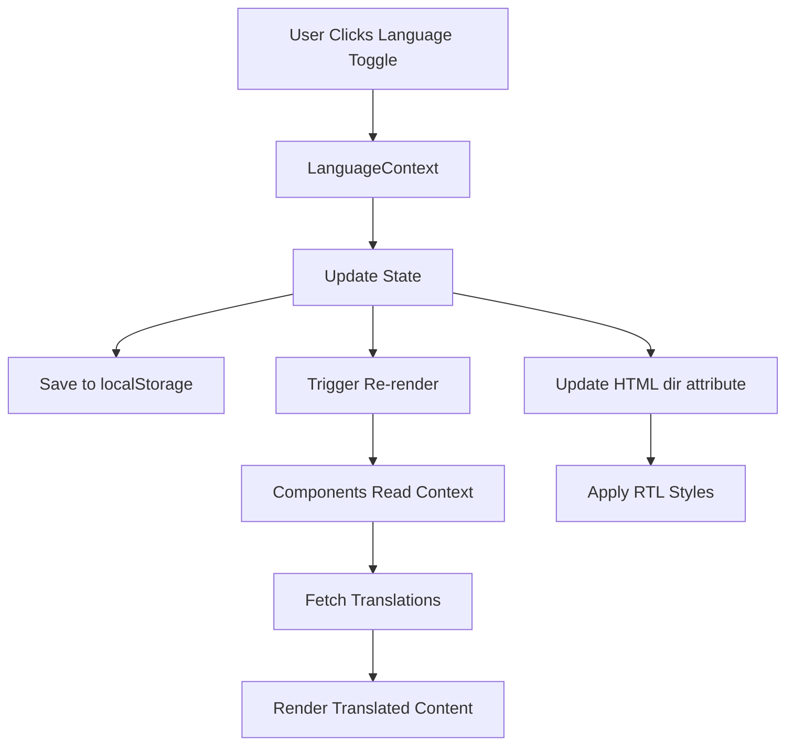

# Design Document: Arabic Translation and RTL Support

## Overview

This design implements a comprehensive internationalization (i18n) solution for the website, enabling seamless switching between English and Arabic languages with full RTL (right-to-left) layout support. The solution leverages React Context API for state management, localStorage for persistence, and CSS logical properties for RTL-aware styling.

The design builds upon the existing `LanguageToggle` component and integrates with Next.js App Router architecture to provide a performant, maintainable translation system.

## Architecture

### High-Level Architecture



### Component Hierarchy

```
RootLayout (app/layout.tsx)
├── LanguageProvider (Context Provider)
│   ├── HTML dir attribute management
│   └── Language state management
└── Application Components
    ├── Header (with LanguageToggle)
    ├── Page Components
    │   ├── Hero
    │   ├── Services
    │   ├── About
    │   ├── Clients
    │   ├── Partners
    │   └── Contact
    └── Footer
```

## Components and Interfaces

### 1. Language Context and Provider

**File:** `lib/language-context.tsx`

```typescript
interface LanguageContextType {
  language: 'en' | 'ar'
  setLanguage: (lang: 'en' | 'ar') => void
  t: (key: string) => string
  dir: 'ltr' | 'rtl'
}
```

**Responsibilities:**
- Manage current language state
- Provide translation function `t(key)`
- Expose text direction for components
- Persist language preference to localStorage
- Update HTML `dir` and `lang` attributes dynamically

**Implementation Details:**
- Use React Context API for global state
- Initialize from localStorage on mount
- Sync with document attributes on language change
- Provide type-safe translation keys

### 2. Translation Data Structure

**File:** `lib/translations.ts`

```typescript
interface Translations {
  [key: string]: {
    en: string
    ar: string
  }
}
```

**Structure:**
```typescript
{
  // Navigation
  'nav.home': { en: 'Home', ar: 'الرئيسية' },
  'nav.services': { en: 'Services', ar: 'الخدمات' },
  'nav.about': { en: 'About', ar: 'من نحن' },
  
  // Hero Section
  'hero.title': { en: 'Enterprise Solutions', ar: 'حلول المؤسسات' },
  'hero.subtitle': { en: 'For ambitious businesses', ar: 'للشركات الطموحة' },
  
  // Nested structure for complex pages
  'services.consulting.title': { en: 'Consulting', ar: 'الاستشارات' },
  'services.consulting.description': { en: '...', ar: '...' }
}
```

**Organization:**
- Flat key structure with dot notation for hierarchy
- Grouped by page/section for maintainability
- Separate files for large sections (optional)
- Type-safe keys using TypeScript

### 3. Enhanced Language Toggle Component

**File:** `components/language-toggle.tsx`

**Updates:**
- Consume `LanguageContext` instead of local state
- Remove localStorage logic (handled by context)
- Add visual feedback for current language
- Support keyboard navigation

### 4. RTL-Aware Layout Component

**File:** `app/layout.tsx`

**Updates:**
- Wrap children with `LanguageProvider`
- Remove hardcoded `lang="en"` attribute
- Add dynamic `dir` attribute binding
- Load RTL-specific fonts if needed (e.g., Arabic fonts)

## Data Models

### Translation Key Structure

```typescript
type TranslationKey = 
  | `nav.${string}`
  | `hero.${string}`
  | `services.${string}`
  | `about.${string}`
  | `clients.${string}`
  | `partners.${string}`
  | `contact.${string}`
  | `footer.${string}`
  | `common.${string}`
```

### Language Preference Storage

```typescript
interface LanguagePreference {
  language: 'en' | 'ar'
  timestamp: number // For future analytics
}
```

**localStorage key:** `'language'` or `'language-preference'`

## RTL Styling Strategy

### CSS Logical Properties

Replace physical properties with logical equivalents:

```css
/* Before (LTR-specific) */
.element {
  margin-left: 1rem;
  padding-right: 2rem;
  text-align: left;
}

/* After (Direction-agnostic) */
.element {
  margin-inline-start: 1rem;
  padding-inline-end: 2rem;
  text-align: start;
}
```

### Tailwind CSS RTL Support

Use Tailwind's RTL modifiers:

```tsx
<div className="ml-4 rtl:mr-4 rtl:ml-0">
  Content
</div>

// Or use logical properties with custom utilities
<div className="ms-4"> {/* margin-inline-start */}
  Content
</div>
```

### Global RTL Styles

**File:** `app/globals.css`

```css
/* RTL-specific adjustments */
[dir="rtl"] {
  direction: rtl;
}

[dir="rtl"] .flex-row {
  flex-direction: row-reverse;
}

/* Preserve LTR for specific elements */
[dir="rtl"] .ltr-content {
  direction: ltr;
}
```

### Component-Specific RTL Handling

**Flexbox and Grid:**
- Use `flex-row-reverse` for RTL
- Adjust `justify-content` and `align-items` as needed
- Grid template areas may need mirroring

**Icons and Images:**
- Most icons don't need flipping
- Directional icons (arrows, chevrons) should flip
- Use CSS `transform: scaleX(-1)` for flipping

**Animations:**
- Horizontal animations should reverse direction
- Carousel/slider navigation should reverse

## Error Handling

### Missing Translations

**Strategy:** Graceful degradation with fallback

```typescript
function t(key: string): string {
  const translation = translations[key]
  if (!translation) {
    console.warn(`Missing translation for key: ${key}`)
    return key // Return key as fallback
  }
  return translation[language] || translation.en || key
}
```

### Invalid Language Preference

```typescript
function loadLanguagePreference(): 'en' | 'ar' {
  try {
    const saved = localStorage.getItem('language')
    if (saved === 'en' || saved === 'ar') {
      return saved
    }
  } catch (error) {
    console.error('Failed to load language preference:', error)
  }
  return 'en' // Default fallback
}
```

### Hydration Mismatch

**Problem:** Server renders with default language, client may have different preference

**Solution:**
- Use `suppressHydrationWarning` on `<html>` and `<body>`
- Initialize language on client mount
- Show loading state or use CSS to hide content briefly

## Testing Strategy

### Unit Tests

**Translation Function:**
```typescript
describe('Translation function', () => {
  it('should return correct translation for valid key', () => {
    expect(t('nav.home')).toBe('Home') // when language is 'en'
  })
  
  it('should fallback to English for missing Arabic translation', () => {
    // Test fallback behavior
  })
  
  it('should return key for completely missing translation', () => {
    expect(t('invalid.key')).toBe('invalid.key')
  })
})
```

**Language Context:**
```typescript
describe('LanguageContext', () => {
  it('should persist language to localStorage', () => {
    // Test localStorage integration
  })
  
  it('should update HTML dir attribute', () => {
    // Test DOM manipulation
  })
})
```

### Integration Tests

**Language Toggle:**
- Click toggle button
- Verify language changes
- Verify content updates
- Verify RTL layout applies

**Page Navigation:**
- Navigate between pages
- Verify language persists
- Verify all content translates

### Visual Regression Tests

**RTL Layout:**
- Screenshot comparison for each page
- Verify layout mirrors correctly
- Check alignment and spacing
- Verify no text overflow

### Manual Testing Checklist

- [ ] All navigation items translate
- [ ] All page content translates
- [ ] RTL layout applies correctly
- [ ] Language persists across navigation
- [ ] Language persists across browser sessions
- [ ] Mobile menu works in both languages
- [ ] Forms and inputs work in RTL
- [ ] Animations work in RTL
- [ ] No console errors or warnings

## Implementation Phases

### Phase 1: Core Infrastructure
1. Create translation data structure
2. Implement LanguageContext and Provider
3. Update RootLayout with Provider
4. Update LanguageToggle to use context

### Phase 2: Translation Content
1. Extract all hardcoded strings
2. Create translation keys
3. Add Arabic translations
4. Implement translation function

### Phase 3: RTL Styling
1. Add CSS logical properties
2. Update Tailwind classes for RTL
3. Add global RTL styles
4. Handle component-specific RTL cases

### Phase 4: Integration and Testing
1. Update all components to use translations
2. Test language switching
3. Test RTL layout
4. Fix any layout issues

### Phase 5: Polish and Optimization
1. Add loading states
2. Optimize translation bundle
3. Add error boundaries
4. Performance testing

## Performance Considerations

### Translation Bundle Size
- Keep translations in memory (small size)
- Consider code-splitting for very large translation sets
- Use tree-shaking for unused translations

### Re-render Optimization
- Use React.memo for components that don't need translation
- Memoize translation function results if needed
- Avoid unnecessary context updates

### Font Loading
- Preload Arabic fonts for faster rendering
- Use font-display: swap for better UX
- Consider variable fonts for size optimization

## Accessibility Considerations

### Language Attributes
- Set `lang` attribute on `<html>` element
- Use `lang` attribute on mixed-language content
- Ensure screen readers announce language changes

### RTL Navigation
- Maintain logical tab order in RTL
- Ensure keyboard navigation works correctly
- Test with screen readers in both directions

### ARIA Labels
- Translate all ARIA labels and descriptions
- Update `aria-label` on LanguageToggle button
- Ensure form labels are translated

## Future Enhancements

1. **Additional Languages:** Framework supports easy addition of more languages
2. **Dynamic Translation Loading:** Load translations on-demand for better performance
3. **Translation Management:** Integration with translation management systems (e.g., Crowdin, Lokalise)
4. **Automatic Language Detection:** Detect user's browser language preference
5. **URL-based Language:** Support `/ar/about` style URLs for SEO
6. **Translation Interpolation:** Support dynamic values in translations (e.g., "Hello, {name}")
